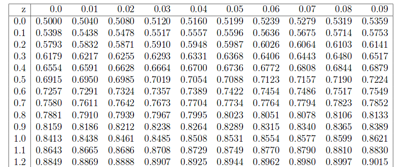

```{r echo=FALSE,results='hide'}
knitr::opts_chunk$set(echo = TRUE,warning = FALSE,message = FALSE)
options(digits=4)
prob=0
```
# Matemáticas III. Algunos EJERCICIOS para ENTRENAR el examen de los temas de: Probabilidad, Variables Aleatorias y Distribuciones Notables.


## Ejercicio `r prob=prob+1; prob`

Consideremos  una v.a. $X$ normal de media $\mu=20$ y $\sigma=50$. Tomamos una muestra aleatoria simple de tamaño $n=100$. Calculad
$P(20< \overline{X}<25 /\overline{X}>20)$ (*0.5 puntos*)





### Solución:

$\begin{aligned}
P(20< \overline{X}<25 /\overline{X}>20)&=\frac{P(20< \overline{X}<25\cap \overline{X}>20)}{1-P( \overline{X}\leq 20))}\\
&=\frac{F_Z\left(\frac{25-20}{\frac{50}{\sqrt{100}}}\right)-F_Z\left(\frac{20-20}{\frac{50}{\sqrt{100}}}\right)}{1-F_Z\left(\frac{20-20}{\frac{50}{\sqrt{100}}}\right)}=
\frac{F_Z(1)-F_Z(0)}{F_Z(0)}.
\end{aligned}$ 

## Ejercicio `r prob=prob+1; prob`

 **(3 puntos)**
Consideremos la v.a. $X$ con función densidad

$$f(x)=\left\{
\begin{array}{cl}
 \displaystyle 0.5& \mbox{si } 0< x <1 \\
\displaystyle\frac{x-1}{2} & \mbox{si } 1\leq x < a \\
 \displaystyle 0 & \mbox{ en cualquier otro caso } \\
\end{array}\right..
$$

a). Calculad el valor de $a$ para que $f$ sea función de densidad.

b). Para el anterior valor de $a$ calculad la función de distribución de $X$.

c). Para el anterior valor de $a$ calculad $E(X)$.

d). Para el anterior valor de $a$ calculad $Var(X)$.


### Solución

Concurso redactar y subir al foro ¡¡¡décimas extra.!!!


