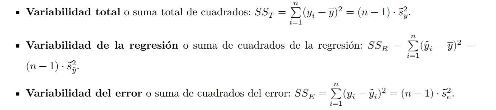

```{r setup, include=FALSE}
knitr::opts_chunk$set(echo = TRUE,warning=FALSE,message = FALSE)
library(tidyverse)
options(scipen=999)
contador=0
cuenta=function(x=contador) {contador<<- contador+1;return(contador)}
set.seed(2020)
```


# Entrega 4 Problemas: Estadística Inferencial 2 

Contestad en GRUPOS  del proyecto a los siguientes problemas y cuestiones en un fichero Rmd y su  salida en html o pdf.

Cambien podéis incluir capturas de problemas hechos en papel. Cada pregunta vale lo mismo y se reparte la nota entre sus apartados.

## Problema `r cuenta()`: Contraste de proporciones de dos muestras independientes.

Queremos comparar las proporciones de aciertos de dos redes neuronales que detectan tipos si una foto con un móvil de una avispa es una [avispa velutina o asiática](https://es.wikipedia.org/wiki/Vespa_velutina). Esta avispa en una especie invasora y peligrosa por el veneno de su picadura.
Para ello disponemos de una muestra de 1000 imágenes de insectos etiquetadas como avispa velutina y no velutina.

[Aquí tenéis el acceso a los datos](http://bioinfo.uib.es/~recerca/MATIIIGINF/velutina). Cada uno está en fichero los aciertos están codificados  con 1 y los fallos con 0.


Se pide:

1. Cargad los datos desde el servidos y calcular el tamaño de las muestras y la proporción de aciertos de cada muestra.
2. Contrastad si hay evidencia de que las las proporciones de aciertos del algoritmo 1  son mayores que las del algoritmo 2. Definid bien las hipótesis y las condiciones del contraste. Tenéis que hacer el contraste con funciones de  `R` y resolver el contrate con el $p$-valor.
3. Calculad e interpretar los intervalos de confianza para la diferencia de proporciones asociados al test anterior, con funciones de R. 


### Solución


```{r}
algoritmo1=read.table("http://bioinfo.uib.es/~recerca/MATIIIGINF/velutina/algoritmo1.csv")
algoritmo2=read.table("http://bioinfo.uib.es/~recerca/MATIIIGINF/velutina/algoritmo2.csv")
```


Proporción aciertos de cada algoritmo

```{r}
n1=dim(algoritmo1)[1]
n1
n1=length(algoritmo1$V1)
n1
n2=length(algoritmo2$V1)
n2
aciertos_absolutos_algoritmo1=table(algoritmo1)["1"]
aciertos_absolutos_algoritmo1
p1=prop.table(table(algoritmo1))["1"]
p1

aciertos_absolutos_algoritmo2=table(algoritmo2)["1"]
aciertos_absolutos_algoritmo2
p2=prop.table(table(algoritmo2))["1"]
p2
```

Después de los cálculos preliminares  si denotamos las proporciones poblacionales de aciertos de cada algoritmo por $p_1$  y $p_2$ respectivamentes,  el  contraste que nos piden es  


$$
\left\{
\begin{array}{ll}
H_0: & p_1=p_2\\
H_1: & p_1>p_2\\
\end{array}
\right.
$$


estamos ante un diseño de comparación de proporciones con muestras independientes. Con R lo podemos resolver con el `fisher.test` o con el `prop.test`

```{r}
x=matrix(c(aciertos_absolutos_algoritmo1,n1-aciertos_absolutos_algoritmo1,
           aciertos_absolutos_algoritmo2,n2-aciertos_absolutos_algoritmo2),
         ncol=2,byrow=FALSE)
x
fisher.test(x,alternative="greater",conf.level=0.95)
```


```{r}
c(aciertos_absolutos_algoritmo1,aciertos_absolutos_algoritmo2)
c(n1,n2)
prop.test(c(aciertos_absolutos_algoritmo1,aciertos_absolutos_algoritmo2), c(n1,n2),alternative="greater",conf.level=0.95)
```


Con ambos test obtenemos $p$ valores altos (el más pequeño es el de fisher y es mayor que $0.4$, así que no podemos rechazar  que las proporciones de aciertos de los dos algoritmos sean  iguales contra que la proporción de aciertos del algoritmo 1 es mejor  que la del 2.


El intervalo  de confianza asociado a este test  es 

```{r}
prop.test(c(aciertos_absolutos_algoritmo1,aciertos_absolutos_algoritmo2), c(n1,n2),alternative="greater",conf.level=0.95)$conf.int
```


luego con una probabilidad del 95\% la $p_1-p_2> -1$  contiene el 0 y no podemos despreciar que sean iguales contra que $p_1>p_2.$

## Problema `r cuenta()` : Contraste de proporciones de dos muestras emparejadas.

En el problema anterior hemos decidido quedarnos con el mejor de los algoritmos y mejorarlo. Pasamos las mismas 1000 imágenes a la version_beta del algoritmo y a la version_alpha.
[Aquí tenéis el acceso a los datos en el mismo orden para las 1000 imágenes](http://bioinfo.uib.es/~recerca/MATIIIGINF/velutina2). Cada uno está en fichero los aciertos están codificados  con 1 y los fallos con 0.


1. Cargad los datos desde el servidos y calcular el tamaño de las muestras y la proporción de aciertos de cada muestra.
2. Contrastad si hay evidencia de que las las proporciones de aciertos del algoritmo alfa  son iguales que las del algoritmo beta. Definid bien las hipótesis y las condiciones del contraste. Tenéis que hacer el contraste con funciones de  `R` y resolver el contrate con el $p$-valor.


### Solución

Cargamos los datos y hacemos los cálculos preliminares

```{r}
algoritmoalfa=read.table("http://bioinfo.uib.es/~recerca/MATIIIGINF/velutina2/algoritmo_alpha.csv")
algoritmobeta=read.table("http://bioinfo.uib.es/~recerca/MATIIIGINF/velutina2/algoritmo_beta.csv")
```


El test que nos piden es 

$$
\left\{
\begin{array}{ll}
H_0: & p_{\alpha}=p_{\beta}\\
H_1: & p_{\alpha}\not=p_{\beta}\\
\end{array}
\right.
$$

Es un diseño de muestras emparejadas y tenemos que utilizar el `mcnear.test`:


```{r}
X=table(algoritmoalfa$V1,algoritmobeta$V1)
X
mcnemar.test(X)
```


El $p$-valor es 0.1356 no podemos rechazar la igualdad de la proporción de aciertos.

## Problema `r cuenta()` : ANOVA comparación media puntuaciones según fabricante.

Una vez mejorado nuestro algoritmo queremos saber su  comportamiento bajo distintos tipos de móviles.

Seleccionamos 6 móviles de la misma gama de calidad de 
6 fabricantes distintos. A los fabricantes los denotamos por F1, F2, F3, F4, F5 y F6.

Vamos a jugar no con la clasificación sino con el score que produce el algoritmo. Para ello seleccionamos 4 muestra aleatorias de fotos de insectos enviadas por los usuarios y la puntuación (*score*)  que nos da el algoritmo que es una variable aleatoria continua de  con rango de 0 a 100.

La idea es comprobar si la media de las puntuaciones del algoritmo es la misma para cada uno de los fabricantes.


Los datos los podéis descargar de esta dirección del  [servidor bioinfo.uib.es](http://bioinfo.uib.es/~recerca/MATIIIGINF/anova_score/).


Antes de descargarlo, visualizar el fichero desde el navegador, para saber cómo descargarlo.


1. ¿Podemos asegurar que la muestras son normales en cada grupo? ¿y son homocedásticas? Justificar la respuesta con el correspondiente código en R comentado.
2. Escribid  formalmente la hipótesis nula y la alternativa. Calcular la tabla de ANOVA y resuelve el test de forma manual. 
3. Calcular la tabla de ANOVA y resuelve el test con la función `aov` de R.
4. Haced una comparación de pares  con la función adecuada de R  para la corrección del holm al nivel de significación $\alpha=0.1$. Interpreta el resultado.
5. Comparar por grupos con  el test de Duncan del paquete `agricolae`. Interpreta el resultado.


### Solución


```{r}
df=read.table("http://bioinfo.uib.es/~recerca/MATIIIGINF/anova_score/score_manufacturer.csv")
head(df)
df$manufacturer=as.factor(df$manufacturer)
```

```{r}
table(df$manufacturer)
```


Tenemos que comprobar la normalidad de la distribución de  la muestra para cada nivel del factor $i=1,2,3,4,5,6$; el test es 


$$
\left\{
\begin{array}{ll}
H_0: & \mbox{la distribución de los datos  en el nivel $F_i$ es normal,}\\
H_1: & \mbox{la distribución de los datos en el nivel $F_i$ no es normal,}\\
\end{array}
\right.
$$


```{r}
library(nortest)
# El test KS_Lillie para en nivel "F1"
#lillie.test(df$score[df$manufacturer=="F1"])
sapply(levels(df$manufacturer), FUN=function(x) {print(lillie.test(df$score[df$manufacturer==x]))})
# También podemos hacer un bucle clásico
#for(Fabricante in levels(df$manufacturer)){
#print(lillie.test(df$score[df$manufacturer==Fabricante]))
#}
```

El nivel "F1" y "F6" dan valores pequeños no podemos asegurar la normalidad  en estos casos.

Nos aseguramos con el ómnibus test de D'Agostino

```{r}
library(fBasics)
dagoTest(df$score[df$manufacturer=="F1"])

dagoTest(df$score[df$manufacturer=="F6"])


```
Parece que no podemos rechazar la normalidad para los casos dudosos.


Ahora realizamos el test de comparación de medias  $\mu_i$ para $i=1,2,3,4,5,6$ son las medias para cada nivel del factor.


$$
\left\{
\begin{array}{ll}
H_0: & \mu_1=\mu_2=\mu_3=\mu_4=\mu_5=\mu_6\\
H_1: & \mbox{no todas la medias son iguales,}\\
\end{array}
\right.
$$


```{r}
summary(aov(df$score~df$manufacturer))
```

Como el $p$-valor es  muy pequeño NO podemos aceptar que las 6 medias sean iguales


Ahora tenemos que contrastar que pares de medias dos a dos  son iguales y ajustar  los $p$-valores con el ajuste del $p$-valor por el método de Holm

```{r}
pairwise.t.test(df$score,df$manufacturer,p.adjust.method = "holm")
```


Comparamos los $p$-valores con $0.05$ y aceptamos que las medias  de los niveles $F_4$, $F_6$ y $F_5$ son iguales dos a dos,  también son iguales la media del $F_1$ con el $F_2$, y la media del nivel $F_2$ con el $F_3$. EL resto de comparaciones  tienen $p$-valores bajos así que no podemos aceptar la igualdad de medias.


Ahora comparamos las medias  por grupos de igualdades  con el test de Duncan

```{r}
library(agricolae)
resultado.anova=aov(df$score~df$manufacturer)
duncan.test(resultado.anova,"df$manufacturer",group=TRUE)$group
```


Obtenemos tres grupos el a dice la media de $\mu_3=mu_2$ el b dice que $\mu_2=\mu_1$ y el c dice que $\mu_6=\mu_4=\mu_5$. Obtenemos conclusiones similares al test de comparación de medias.


## Problema `r cuenta()`: Regresión lineal simple.


Consideremos los siguientes  datos


```{r}
x=c(-2,-1,2,0,1,2)
y=c(-7, -5,  5, -3,  3.0,  4)
summary(lm(y~x))
```
1. Calcular manualmente los coeficiente de  la regresión lineal de y sobre x
2. Calcular los valores $\hat{y}_i=b_0+b_1\cdot x_1$ para los valores de la muestra y el error cometido.
3. Calcular la estimación de la varianza del error.
4. Resolver manualmente el contraste 
$\left\{\begin{array}{ll} H_0: & \beta_1=0 \\ H_1: & \beta_1\not=0\end{array}\right.,$ calculando el $p$-valor.
5. Calcular $SST$, $SSR$ y $SSE$.
6. Calcular el coeficiente de regresión lineal $r_{xy}$ y el coeficiente de determinación $R^2$. Interpretad el resultado en términos de la cantidad de varianza explicada por el modelo
7. Comprobar que los resultados son los mismos que los obtenidos con la  función `summary(lm(y~x))`.


### Solución

Faltan añadir los NECESARIOS COMENTARIOS.

```{r}
x=c(-2,-1,2,0,1,2)
y=c(-7, -5,  5, -3,  3.0,  4)
sol_lm=lm(y~x)
summary(sol_lm)
```


```{r}
mediay=mean(y)
mediax=mean(x)
sdx=sd(x)
sdy=sd(y)
sxy=cov(x,y)
b1=sxy/sdx^2
b1
b0=mediay-b1*mediax
b0
sol_lm$coefficients
c(b0,b1)==sol_lm$coefficients# dan distintos errores de redondeo
near(c(b0,b1),sol_lm$coefficients)# opcional
```


```{r}
sol_lm$fitted.values
recta=function(x) b0+b1*x
y_est=recta(x)
y_est
predict(sol_lm,newdata = data.frame(x=x))
```


```{r}
y
y_est
e=y-y_est
e
sol_lm$residuals
mean(e) # es cero, pero por error de redondeo no da exacto.
SSE=sum(e^2)
SSE
n=length(x)
n
S2=SSE/(n-2)#estimacion_var_error
S2
S=sqrt(S2)# Residual standard error: 1.165
S
round(S,3) # con los mismos decimales da lo mismo
```


```{r}
 # contraste beta1=0
t0=b1/(S/(sdx*sqrt(n-1)))
t0
2*pt(abs(t0),n-2,lower.tail = FALSE)
2*(1-pt(abs(t0),n-2,lower.tail = TRUE))
2*(1-pt(abs(t0),n-2))
```
comparar con 

```
Coefficients:
            Estimate Std. Error t value Pr(>|t|)    
(Intercept)  -1.5250     0.4872  -3.130 0.035176 *  
x             3.0750     0.3189   9.642 0.000647 ***
```


```{r out.width = "400px"}

```


```{r}
SST=sum((y-mean(y))^2)
SST
mean(y_est)
mean(y)#media estimados regresion igual a media variable y

SSR=sum((y_est-mean(y))^2)
SSR
SSE# ya lo había a calculado
SST-SSR# da lo mismo pues SST=SSR+SSE 
```

```{r}
R2=SSR/SST
R2
cor(x,y)
cor(x,y)^2# en el caso regre simp`le R2=cor(xy)^2
```


## Problema `r cuenta()`: Distribución de los grados de un grafo de  contactos.
 
En el artículo de A. Broder et al., [Graph structure in the Web. Computer Networks 33, 309 (2000)](http://snap.stanford.edu/class/cs224w-readings/broder00bowtie.pdf). 

Se recopiló el número de enlaces a sitios web encontrados en un rastreo web de 1997 de aproximadamente 200 millones de páginas web, 

Con el se construyó una [tabla](http://tuvalu.santafe.edu/~aaronc/powerlaws/data/weblinks.hist) con  la frecuencia de sitios  por número de enlaces. El código siguiente carga del enlace que han puesto los autores del artículo

```{r}
data_links=read.table("http://tuvalu.santafe.edu/~aaronc/powerlaws/data/weblinks.hist",header=TRUE)
head(data_links)
str(data_links)
# eliminamos la páginas con menos de 8 enlaces  enlaces y las de más de 1000 enlaces
data_links_central=data_links[data_links$degree>8&data_links$degree<10^3,]
head(data_links_central)
tail(data_links_central)
```

El siguiente código calcula las regresiones exponecial, potencial y lineal (en algún orden) de las frecuencias (`frequency`) contra los enlaces (`degree`).

```{r}
sol1=lm(frequency~ degree,data=data_links_central)
summary(sol1)
sol2=lm(log10(frequency)~ degree,data=data_links_central)
summary(sol2)
sol3=lm(log10(frequency)~ log10(degree),data=data_links_central)
summary(sol3)

```

Ahora dibujamos los gráficos adecuados a cada modelo

```{r}
plot(data_links_central,main="Modelo ..........")
abline(sol1,col="red")
plot(data_links_central,main="Modelo ..........",log="y")
abline(sol2,col="red")
plot(data_links_central,main="Modelo ..........",log="xy")
abline(sol3,col="red")
```


Se pide:

1. Explicad el modelo de regresión que calcula cada función `lm`
2. ¿Qué modelo y en función de qué parámetros es el mejor?
3. Para el mejor modelo calcular los coeficientes en las unidades originales  y escribir la  ecuación del modelos.


### Solución

**Apartado 1**

Los modelos son 

```{r}
sol1=lm(frequency~ degree,data=data_links_central)
summary(sol1)
sol2=lm(log10(frequency)~ degree,data=data_links_central)
summary(sol2)
sol3=lm(log10(frequency)~ log10(degree),data=data_links_central)
summary(sol3)
```

Así que 

* el primero es $frequency = b_0+b_1\cdot degree$ que el el modelo LINEAL que resuelve la fución `lm`.
* el segundo es $\log_{10}(frequency) = b_0+b_1\cdot degree$ que operando adecuadamente es $10^\log_{10}(frequency)=10^{b_0}\cdot 10^{b_1\cdot degree}$ operando obtenemos que 
el modelo final es un modelo EXPONENCIAL $frequency=10^{b_0}\cdot \left(10^{b_1}\right)^{degree}$.
* el tercer modelo es $\log_{10}(frequency) = b_0+b_1\cdot \log_{10}(degree)$ que despejando es $10^\log_{10}(frequency)=10^{b_0}\cdot \left(10^\left(\log_{10}(degree)\righ)\right)^{b_1}$ operando obtenemos que 
el modelo final es un modelo POTENCIAL $frequency=10^{b_0}\cdot degree^{b_1}.$


Los dibujos con el título adecuado son

```{r}
plot(data_links_central,main="Modelo lineal")
abline(sol1,col="red")
plot(data_links_central,main="Modelo exponencial",log="y")
abline(sol2,col="red")
plot(data_links_central,main="Modelo potencial",log="xy")
abline(sol3,col="red")
```


Con lo que hemos visto el modelo con mejor $R^2$ es el mejor


```{r}
summary(sol1)$r.squared
summary(sol2)$r.squared
summary(sol3)$r.squared
```

Así  que  el mejor modelo es el tercero el pontecial pues su $R^2$ es  muy alto

**Apartado 3**

Calcularemos la ecuación del modelo para las unidades originales sin transformaciones logarítmicas.

Recordemos el  resultado de la `sol3`

```{r}
summary(sol3)
```

Los estimadores son $b_0=8.722036$ y $b_1=-2.170129$ el modelo es $frequency=10^{b_0}\cdot degree^{b_1}$. Sustitutendo los valores el modelo obtenemos $frequency=10^{8.722036}\cdot degree^{-2.170129}$, finalmente operando 

$$frequency=`r 10^(8.722036)`\cdot degree^{-2.170129}.$$


No se pedía en el ejercicio pero hacemos el dibujo de los datos y la ecuación en las unidades originales


```{r}
frequency=data_links_central$frequency
degree=data_links_central$degree
potencial=function(x) 10^(8.722036)*x^(-2.170129)
plot(degree,frequency,main="Modelo potencial",xlab="degree",ylab="frequency")
curve(potencial,xlim=c(0,1000),ylim=c(0,3731928),col="red",add=TRUE)
```


