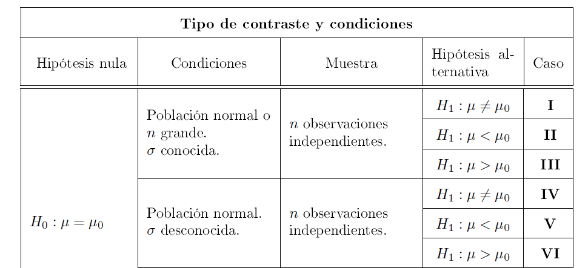
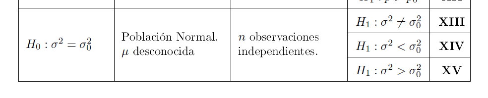
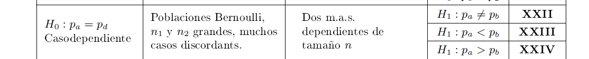
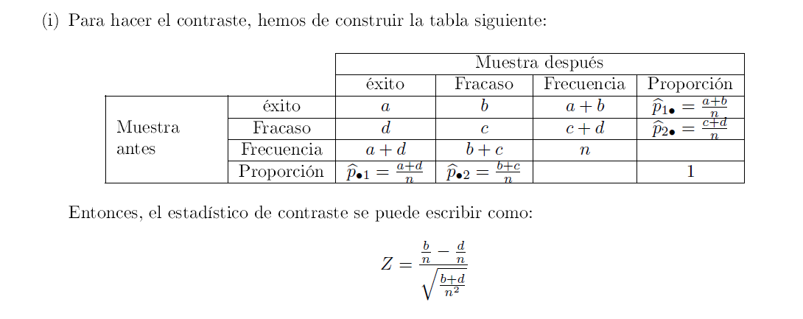

```{r setup, include=FALSE}
knitr::opts_chunk$set(echo = TRUE,cache=TRUE)
library(tidyverse)
options(scipen=999)
contador=0
cuenta=function(x=contador) {
  contador<<- contador+1;return(contador)}
set.seed(2020)
```


#  Taller 2  evaluable. Entrega de problemas

Taller en grupo entregad las soluciones en .Rmd y .html o .pdf. o  escribirlas de forma manual y escanear el resultado, en un solo fichero. Cada apartado vale 1 punto en total hay 15 puntos y se pondera la 10 puntos.

## Problema 1

a.   Consideremos la siguiente muestra aleatoria simple  de una v.a. continua  $X$: $-3,-2,-1,0,0,1,2,3,4$ de tamaño $n=9$.
Calcular, en esta muestra, el error estándar de  estadístico media aritmética de la muestra.
b.  Consideremos la siguiente muestra aleatoria simple  de tamaño $n=10$ de una v.a. $X$ con distribución $Ber(p)$: $1,0,1,0,1,1,1,1,1,0$
Calcular, en esta muestra, el estadístico proporción muestral y su  error estándar.
d. Suponiendo que la población es normal calcular  un intervalo de confianza del $95\%$ para $\mu_X$.
e. Suponiendo que la población es normal calcular  un intervalo de confianza del $95\%$ para $\sigma^2_X$.

Ayuda de R, acabad vosotros los cálculos

```{r}
muestra1=c(-3,-2,-1,0,0,1,2,3,4)
mean(muestra1)
sum(muestra1)
sum(muestra1^2)
n=length(muestra1)
n
muestra2=c(1,0,1,0,1,1,1,1,1,0)
table(muestra2)
length(muestra2)
```


###  Solución


**Apartado a)**

```{r rsultados_1a,include=FALSE}
muestra1=c(-3,-2,-1,0,0,1,2,3,4)
media=mean(muestra1)
desv_tip=sd(muestra1)
error_estandar_media=desv_tip/sqrt(n)
```


La muestra es $x_1=-3,x_2=-2,x_3=-1,x_4=0,x_5=0,x_6=1,x_7=1,x_7=2,x_8=3,x_9=4$, es de tamaño $n=9$ media aritmética es 


$$
\overline{x}= \frac{\displaystyle\sum_{i=1}^{n} x_i}{n}=\frac{-3-2-1+0+0+1+2+3+4}{9}=\frac{4}{9}=`r 4/9`.
$$

La desviación típica de la muestra es 

$$
\tilde{s}_{X}=\sqrt{\left(\frac{n}{n-1}\right)\cdot \left(\frac{\displaystyle\sum_{i=1}^{n} x_i^2}{n}-\overline{x}^2\right)}=\sqrt{\left(\frac{9}{8}\right)\cdot \left(\frac{44}{9}-`r 4/9`^2\right)}=
`r sqrt(n/(n-1)* (sum(muestra1^2)/n-mean(muestra1)^2))`
$$

Donde 44  es el resultado del código `sum(muestra1^2)`


Por último el error estándar de $\overline{x}$ es 

$$\frac{\tilde{s}_X}{\sqrt{n}}=
\frac{`r desv_tip`}{\sqrt{9}}=`r desv_tip/sqrt(9)`.
$$
Con R


```{r resultados_1a_2}
muestra1=c(-3,-2,-1,0,0,1,2,3,4)
media=mean(muestra1)
media
desv_tip=sd(muestra1)
desv_tip
error_estandar_media=desv_tip/sqrt(n)
error_estandar_media

```


**Apartado b)**

```{r resultados_1b,include=FALSE}
muestra2=c(1,0,1,0,1,1,1,1,1,0)
frecuencias=table(muestra2)
n=length(muestra2)
exitos=frecuencias[2]
phat=exitos/n
error_estandar_phat=sqrt(phat*(1-phat)/n)
```


La muestra es $x_1=1,x_2=0,x_3=1,x_4=0,x_5=0,x_6=1,x_7=1,x_7=1,x_8=1,x_{1}=0$, es de tamaño $n=10$ media aritmética es 


$$
\hat{p}= \frac{\mbox{número de 1's}}{n}=\frac{7}{10}=`r 7/10`.
$$

Error estándar de $\hat{p}$ es 

$$
\sqrt{\frac{\hat{p}\cdot (1-\hat{p})}{n}}=\sqrt{\frac{`r phat`\cdot (1-`r phat`)}{`r n`}}=
`r sqrt(phat*(1-phat)/n)`
$$

Con R


```{r resultados_1b_2}
muestra2=c(1,0,1,0,1,1,1,1,1,0)
frecuencias=table(muestra2)
frecuencias
n=length(muestra2)
n
exitos=frecuencias[2]
exitos
phat=exitos/n
phat
error_estandar_phat=sqrt(phat*(1-phat)/n)
names(error_estandar_phat)=NULL
error_estandar_phat
```
**Apartado c**

Bajo estas condiciones población normal $\sigma$ desconocida el intervalo  para $\mu$ al  nivel de confianza del 95\%  es el del caso IV de la tabla de contrastes de una muestra

```{r ,echo=FALSE}

```

```{r , echo=FALSE}
knitr::include_graphics("casoIV_2.PNG",dpi=180)
```

```{r}
media=mean(muestra1)
media
n=length(muestra1)
n
desv_tip=sd(muestra1)
desv_tip
alpha=1-0.95# 1-alpha/2=0.975
cuantil=qt(1-alpha/2,df=n-1)# cuantil  0.975 de la t de student con n-1 grados de libertad.
cuantil
```


El intervalo de confianza para $\mu$ al nivel de confianza del $95\%$  es 

\begin{eqnarray*}
&&\left]\overline{x}-t_{n-1,1-\alpha/2} \cdot \frac{\tilde{s}_X}{\sqrt{n}},
\overline{x}+t_{n-1,1-\alpha/2} \cdot \frac{\tilde{s}_X}{\sqrt{n}}
\right[\\
=&&
\left]
`r media`-`r cuantil` \cdot \frac{`r desv_tip`}{`r sqrt(n)`},
`r media`+`r cuantil` \cdot \frac{`r desv_tip`}{`r sqrt(n)`}
\right[\\
=&&
\left]
`r media-cuantil*desv_tip/sqrt(n)`,
`r media+cuantil*desv_tip/sqrt(n)`,
\right[\\.
\end{eqnarray*}


Con R se puede calcular así también


```{r}
t.test(muestra1,alternative = "two.sided",conf.level = 0.95)-> solucion
solucion$conf.int
```


**Apartado d**

Bajo estas condiciones población normal el intervalo  para $\sigma^2_X$ al  nivel de confianza del 95\%  es el del caso XIII de la tabla de contrastes de una muestra

```{r ,echo=FALSE}

```

```{r dostablab,hecho=FALSE}
knitr::include_graphics("casoXIII_2.PNG",dpi=180)
```

```{r}
media=mean(muestra1)
media
n=length(muestra1)
n
desv_tip=sd(muestra1)
desv_tip
alpha=1-0.95# 1-alpha/2=0.975
cuantil_1=qchisq(1-alpha/2,df=n-1)# cuantil  0.975 de una chi^2 con n-1 grados de libertad.
cuantil_1
cuantil_2=qchisq(alpha/2,df=n-1)# cuantil  0.025 de una chi^2 con n-1 grados de libertad.
cuantil_2
```


El intervalo de confianza para $\sigma^2$ al nivel de confianza del $95\%$ es 


$$
\left]\frac{(n-1)\cdot \tilde{s}^2_X}{\chi^2_{n-1,1-\alpha/2}},
\frac{(n-1)\cdot \tilde{s}^2_X}{\chi^2_{n-1,\alpha/2}}
\right[
=
\left]
\frac{`r (n-1)`\cdot `r desv_tip`^2}{`r cuantil_1`},
\frac{`r (n-1)`\cdot `r desv_tip`^2}{`r cuantil_2`}
\right[
=
\left]
`r (n-1)*desv_tip^2/cuantil_1`,
`r (n-1)*desv_tip^2/cuantil_2`
\right[.
$$


## Problema 2 


Queremos comparar los rendimientos medidos en consumo de CPU  de dos  configuraciones (C1 y C2)  de un servidor de datos   tienen una media similar,de hecho queremos tener evidencia contra que el rendimiento medio del  servidor C1 es superior al del servidor C2. No conocemos $\sigma_1$ y $\sigma_2$.
Disponemos de dos muestras independientes  de consumo por hora
realizados para cada configuración C1 y C2, de tamaños  $n_1=n_2=100$, respectivamente.

Para bajarlos utilizad la dirección del los ficheros `raw`  que se muestran en el siguiente código


```{r cargadatosoculta,size="tiny"}
C1=read.csv(
  "https://raw.githubusercontent.com/joanby/estadistica-inferencial/master/datasets/C1.csv",
            header=TRUE)$time
C2=read.csv(
  "https://raw.githubusercontent.com/joanby/estadistica-inferencial/master/datasets/C2.csv",
  header=TRUE)$time

n1=length(na.omit(C1))
n1
n2=length(na.omit(C2))
n2
media.muestra1=mean(C1,na.rm=TRUE)
media.muestra1
media.muestra2=mean(C2,na.rm=TRUE)
media.muestra2
desv.tip.muestra1=sd(C1,na.rm=TRUE)
desv.tip.muestra1
desv.tip.muestra2=sd(C2,na.rm=TRUE)
desv.tip.muestra2
```

Calculamos las medias y las desviaciones típicas muestrales de los tiempos empleados para cada muestra. Los datos obtenidos se resumen en la siguiente tabla:


$$
\begin{array}{llll}
n_1&=`r n1`, & n_2&=`r n2`\\
\overline{x}_1&=`r media.muestra1`, & \overline{x}_2&=`r media.muestra2`\\
\tilde{s}_1&=`r desv.tip.muestra1`, & \tilde{s}_2&=`r desv.tip.muestra2`
\end{array}
$$
Se pide:

a. Comentad brevemente el código de R explicando que hace cada instrucción.
b. Contrastad si hay evidencia de que los rendimientos medios son distintas entre los dos grupos. En dos casos considerando las varianzas desconocidas pero iguales o desconocidas pero distintas. Tenéis que hacer el contraste de forma manual y con funciones de  `R` y resolver el contrate con el $p$-valor. 
c. Calculad e interpretar los intervalos de confianza BILATERALES al nivel de confianza del $95\%$ para la diferencia de medias de los rendimientos en los casos anteriores. 
d. Comprobad con el test de Fisher y el de Levene si las varianza de las dos muestras son iguales contra que son distintas. Tenéis que resolver el test de Fisher con `R` y de forma manual y el test de Levene con `R`  y decidir utilizando el $p$-valor. 


### Solución

**Apartado 1.** El cogido R carga en las variables C1 y C2 la variables `time` de dos data frames de un servidor  en github y por lo tanto hemos tenido que pasar la url del fichero original o  *raw*.

Luego calcula los estadísticos básicos para  realizar las siguientes preguntas. Para los tamaños muestrales $n_1$ y $n_2$  se omiten los valores `NA` antes de asignar la `length` de los arrays. También se calculan las medias y las desviaciones típicas muestrales omitiendo (si es que hay)  los valores no disponibles.

**Apartado 2.**
Denotemos por $\mu_1$ y $\mu_2$ las medias de los tiempos de las configuraciones  1 y 2 respectivamente. El contraste que se pide  es


$$
\left\{\begin{array}{ll}
H_0:\mu_{1} = \mu_{2}\\
H_1: \mu_{1} > \mu_{2}
\end{array}\right.
$$


Estamos en un diseño de comparación de medias  entre dos muestras  independientes ambas de tamaño `r n1` que es grande. Tenemos dos casos varianzas desconocidas pero iguales y varianzas desconocidas pero distintas. Las funciones de R del contraste  para estos casos son:


**Varianzas iguales**

```{r}
# test para varianzas iguales
t.test(C1,C2,var.equal = TRUE,alternative = "greater")
```
**Varianzas distintas**

```{r}
# test para varianzas distintas
t.test(C1,C2,var.equal = FALSE,alternative = "greater")
```

El $p$-valor en ambos casos es muy pequeño así que la muestra  no aporta evidencias rechazar la hipótesis nula las medias son iguales contra que son distintas.


Veamos el cálculo manual.


**Varianzas desconocidas pero iguales, $n_1$ y $n_2$ grande** 

Si suponemos que $\sigma_1=\sigma_2$, el estadístico de contraste es
$$
t0=\frac{\overline{X}_1-\overline{X}_2}
{\sqrt{(\frac1{n_1}+\frac1{n_2})\cdot 
\frac{((n_1-1)\widetilde{S}_1^2+(n_2-1)\widetilde{S}_2^2)}
{(n_1+n_2-2)}}}=\frac{`r media.muestra1`-`r media.muestra2`}
{\sqrt{(\frac1{`r n1`}+\frac1{`r n2`})\cdot 
\frac{((`r n1`-1) `r desv.tip.muestra1`^2+(`r n2`-1)`r desv.tip.muestra2`^2)}
{(`r n1`+`r n2`-2)}}}
$$

```{r estadisticos_ejer1}
t0=(media.muestra1-media.muestra2)/
  sqrt((1/n1+1/n2)* 
((n1-1) *desv.tip.muestra1^2+(n2-1)*desv.tip.muestra2^2)/(n1+n2-2))
t0
```


operando obtenemos que  $t0=`r round(t0,6)`.$ y sabemos que  sigue una distribución  $t$-Student $t_{n_1+n_2-2}=t_{`r n1+n2-2`}$. Para este hipótesis alternativa el $p$-valor es 

$P(t_{`r n1+n2-2`}>`r t0`)$, lo calculamos con R 


```{r estadisticos_ejercico1_2}
t0=(media.muestra1-media.muestra2)/
  sqrt((1/n1+1/n2)* 
((n1-1)*desv.tip.muestra1^2+(n2-1)*desv.tip.muestra2^2)/(n1+n2-2))
t0
n1
n2
(1-pt(t0,df=n1+n2-2)) # calculo la probabilidad del complementario
pt(t0,df=n1+n2-2,lower.tail = FALSE)# calcula el área la cola  superior

```


**Varianzas desconocidas pero distintas, $n_1$ y $n_2$ grande**

Si suponemos que $\sigma_1\neq \sigma_2$, el estadístico de contraste es
$t0=\frac{\overline{X}_1-\overline{X}_2}{\sqrt{\frac{\widetilde{S}_1^2}{n_1}+\frac{\widetilde{S}_2^2}{n_2}}}\sim t_f,$
que, cuando $\mu_1=\mu_2$, tiene distribución (aproximadamente, en caso de muestras grandes) $t_{f}$ con

$$
f=\frac{\displaystyle \left( \frac{\widetilde{S}_1^2}{n_1}+\frac{\widetilde{S}_2^2}{n_2}\right)^2}
{\displaystyle \frac1{n_1-1}\left(\frac{\widetilde{S}_1^2}{n_1}\right)^2+\frac1{n_2-1}\left(\frac{\widetilde{S}_2^2}{n_2}\right)^2}
$$

Calculamos el estadístico  y los grados de libertad con R

```{r}
t0=(media.muestra1-media.muestra2)/
  sqrt(desv.tip.muestra1^2/n1+desv.tip.muestra2^2/n2)
t0

f=(desv.tip.muestra1^2/n1+desv.tip.muestra2^2/n2)^2/
  ((1/(n1-1))*(desv.tip.muestra1^2/n1)^2+
     (1/(n2-1))*(desv.tip.muestra2^2/n2)^2)
f
```

El $p$ valor es 


```{r}
# el p-valor de la función t.test de  R
pt(t0,f,lower.tail = FALSE)
```


**Apartado 3**

Los intervalos de confianza  BILATERALES al nivel del 95% los podemos obtener así


```{r}
t.test(C1,C2,var.equal=TRUE,
       alternative ="two.sided",
       conf.level=0.95)$conf.int
t.test(C1,C2,var.equal=FALSE,
       alternative="two.sided",
       conf.level = 0.95)$conf.int
```


Son similares, podemos asegurar que   la diferencia de medias se encuentra $3.33<\mu_1-\mu_2< 6.24$ al nivel del 95 la CPU del tipo  C1 tiene una media de tiempo  entre 3.33 y 6.14 mayor que la del y tipo C2. aproximadamente.


**Apartado 4**
El test que nos piden es el de igualdad de varianzas


$$\left\{\begin{array}{ll}H_0: & \sigma_1^2=\sigma_2^2\\
H_1: & \sigma_1^2\not=\sigma_2^2\end{array}\right..$$


El test de Fisher de igualdad de varianzas

```{r}
var.test(C1,C2,alternative ="two.sided" )
```

Obtenemos un $p$-valor bajo muy bajo no podemos aceptar la igualdad de varianzas.


De forma manual el estadístico de este test sabemos que es 


$$f_0=\frac{\tilde{S_1}^2}{\tilde{S_2}^2}=\frac{`r desv.tip.muestra1^2`}{`r desv.tip.muestra2^2`}=`r desv.tip.muestra1^2/desv.tip.muestra2^2`.$$

Que sigue una ley de distribución de  Fisher
y el $p$_valor es $\min\{2\cdot P(F_{n_1-1,+n_2-1}\leq f_0),2\cdot P(F_{n_1-1,+n_2-1}\geq f_0)\}.$

que con R es 


```{r}
n1
n2
f0=desv.tip.muestra1^2/desv.tip.muestra2^2
f0
pvalor=min(2*pf(f0,n1-1,n2-2),2*pf(f0,n1-1,n2-2,lower.tail = FALSE))
pvalor
```


Obtenemos los mismos resultados que con la función `var.test`.


El test de Levene con R tiene las mismas hipótesis que el anterior

```{r levene1,warning=FALSE}
library(car,quietly = TRUE)# pongo quietly para que quite avisos
tiempo=c(C1,C2)
grupo=as.factor(c(rep(1,length(C1)),rep(2,length(C1))))
leveneTest(tiempo~grupo)
```

El $p$-valor obtenido es bajo así que el test de Levene  aporta evidencias contra la igualdad de varianzas entre de los tiempos de los dos grupos.


## Problema 3 

Se prueba la misma implementación de una algoritmo para reconocer caras de la base de  datos de una empresa  con dos diferente tipos de cámaras. 

Para ello  $n=100$ trabajadores pasan por cada una de las cámaras 1 vez.

Los resultados se pueden cargar  con el siguiente código.


```{r}
caras=read.csv(
  "https://raw.githubusercontent.com/joanby/estadistica-inferencial/master/datasets/caras.csv",
            header=TRUE)
str(caras)
table(caras$aciertoA,caras$aciertoB)

```

Donde `empleadop`  es la variable  el identificador del empleado  y  `aciertoA`  y   `aciertoB`  valen 1  si se acierta la identidad y 0 si se falla para  el mismo empleado en cada una de las cámaras.  


Se pide:

a. Cargad los datos desde el servidos y calcular el tamaño de las muestras y la proporción de aciertos de cada muestra.
b. Contrastad si hay evidencia de que las las proporciones de aciertos con la cámara A  son iguales que las  del algoritmo con la cámara B. Definid bien las hipótesis y las condiciones del contraste. Resolver el contraste de forma manual utilizando  `R` solo como calculadora  y resolver el contraste con el $p$-valor (calculado con R).
c. Resolver el contraste con funciones de  R.
d. Calcular un intervalo de confianza bilateral para la diferencia de la proporciones al nivel de confianza del $95\%$ con R y de forma manual utilizando R  como calculadora y para calcular los cuantiles.


###  Solución


**Apartado a**

Cargamos los datos y hacemos los cálculos preliminares directamente desde el raw del github y construimos la tabla  de contingencia de aciertos y fallos en las cámaras A y B

```{r}
caras=read.csv(
  "https://raw.githubusercontent.com/joanby/estadistica-inferencial/master/datasets/caras.csv",
            header=TRUE)
str(caras)
tabla=table(caras$aciertoA,caras$aciertoB)
tabla
```

**Apartado b**

Lo haremos por la tabla de comparación de dos proporciones  para muestras  emparejadas
es el caso XXII de la tablas de contrastes de dos muestras

Si denotamos por $p_A$ a la  proporción de  aciertos en la cámara A y $p_B$ proporción de aciertos en la cámara $B$  para muestras emparejadas. El contraste  es 

$$
\left\{
\begin{array}{ll}
H_0: & p_{A}=p_{B}\\
H_1: & p_{A}\not=p_{B}\\
\end{array}
\right.
$$


```{r graphicos3_1,echo=FALSE}

```

```{r graphicos3_2,echo=FALSE}

knitr::include_graphics("casoXXII_2.PNG",dpi=180)
```

```{r graphicos3_3,echo=FALSE}

```

Así que el estadístico son las discordancias


```{r}
tabla=table(caras$aciertoA,caras$aciertoB)
tabla

```


Tenemos que las discordancias son $b=1$ es la frecuencia éxito en la A (filas) y fracaso en la B (columna) y $d=12$  es la frecuencia fracaso en la A (filas) y éxito  en la B (columna) y $n=100$

```{r}
b=1
d=12
n=100
z=(b/n-d/n)/sqrt((b+d)/n^2)
z
pvalor=2*pnorm(abs(z),lower.tail=FALSE)
pvalor
```


El estadístico es 


$$
Z=\frac{\frac{b}{n}-\frac{d}{n}}{\sqrt{\frac{b+d}{n^2}}}=
\frac{\frac{`r  b`}{`r  n`}-\frac{`r  d`}{`r  n`}}{\sqrt{\frac{`r  b`+`r  d`}{`r  n`^2}}}=`r  z`.
$$


**Apartado c**


Es un diseño de muestras emparejadas y podemos por ejemplo con R  utilizar el `mcnear.test` (aunque no es exactamente el mismo que el test anterior):


```{r}
mcnemar.test(tabla)
```


El $p$-valor es 0.1356 no podemos rechazar la igualdad de la proporción de aciertos.


**Apartado d**

Necesitamos estos cálculos 

```{r}
tabla
pA=(87+1)/100
pA
pB=(12+87)/100
pB
b=1
d=12
n=100
alpha=1-0.95
alpha
cuantil=qnorm(1-0.05/2)
cuantil
```


Viendo  las tablas  tenemos que calcular 

$\hat{p}_{\bullet 1}=\hat{p}_A=`r pA`$ proporción aciertos en $A$,
$\hat{p}_{1 \bullet}=\hat{p}_B=`r pB`$ proporción aciertos en $B$


El intervalo de confianza al nivel 95% es  ($\alpha=0.05$)

\begin{eqnarray*}
&&\left]
\hat{p}_{A}-\hat{p}_{B}-z_{1-\frac{\alpha}{2}}
\sqrt{\frac{b+d}{n^2}},
\hat{p}_{A}-\hat{p}_{B}+z_{1-\frac{\alpha}{2}}
\sqrt{\frac{b+d}{n^2}}
\right[
\\
&&=
\left]
`r pA`-`r pB`-`r cuantil`\cdot \sqrt{\frac{`r b`+`r d`}{`r n`^2}},
`r pA`-`r pB`+`r cuantil`\cdot \sqrt{\frac{`r b`+`r d`}{`r n`^2}}
\right[\\
&&=
\left]
`r pA- pB - cuantil* sqrt((b+d)/(n^2))`,
`r pA- pB + cuantil* sqrt((b+d)/(n^2))`
\right[
\end{eqnarray*}


## Problema 4

 
 
El encargado de calidad piensa que $X=$ número de quejas de clientes  por día en las oficinas de atención al cliente de una determinada zona de una ciudad sigue una ley $Po(\lambda=5)$. Para comprobarlo toma una muestra de $n=100$ días:


```{r}
quejas=read.csv(
  "https://raw.githubusercontent.com/joanby/estadistica-inferencial/master/datasets/quejas.csv",
            header=TRUE)
str(quejas)
ni=c(0,table(quejas))
names(ni)[1]="0"
ni
n=sum(ni)
n
pi=c(dpois(0:10,lambda=5),1-sum(dpois(0:10,lambda=5)))
names(pi)=c(paste0("Prob(X=",0:10,")"),"Prob(X>=11)")
pi
sum(pi)
ei=n*pi
ei
ei>5 
# no se cumple la condición para el test chi^2
#hay que agrupar los 3 primeros y los 3 últimos
# test chi^2 sin agrupar...
chi0=sum((ei-ni)^2/ei)
chi0

k=12# clases   de 0 a mayor o igual 11
k=12# clases de 0 a 11
pchisq(chi0,df=k-1,lower.tail=FALSE)
```

Se pide:

a. Plantead un contraste de bondad de ajuste  $\chi^2$ $H_0$: los datos siguen una distribución $Po(\lambda=5)$. Calculas las probabilidades y frecuencias esperadas utilizando los datos del código anterior.
b. Reagrupar los datos y resolver el test manualmente pero usando R para el cálculo del $p$-valor. Resolver el contraste
c. Resolver el contraste con la función adecuada  de  R.


###  Solución

**Apartado a**

El contraste que se pide es 

$$
\left\{\begin{array}{ll}
H_0: &\mbox{El número de quejas diarias sigue una  distribución } Po(\lambda=5)\\
H_1: &\mbox{El número de quejas diarias sigue otra  distribución}
\end{array}\right.
$$


Con el código que se  dan las frecuencias observadas  es el array `ni` hay $k=12$ clases y  las probabilidades de cada clase  bajo la hipótesis nula estén en `pi`  el valor de $n=100$ y las frecuencias esperadas están en `ei`


```{r}
#observadas
ni
k=length(ni)# numero de clases
k
pi# probabilidad de cada  supuesto que H0 es cierta  Po(lambda=5)
n#  tamaño de la muestra 
ei# frecuencias esperadas de cada  supuesto que H0 es  cierta  Po(lambda=5)
```
**Apartado b**


El siguiente código hace los cálculos manualmente para agrupar las clases que obtienen frecuencias absolutas esperadas "ei" inferiores a 5.  Agrupamos las tres primeras clases y las tres últimas quedando ahora $k=8$
clases/grupos.


```{r}
ni
pi
chisq.test(ni,p=pi)
chisq.test(ni,p=pi,simulate.p.value = TRUE,B=5000)# test simulando 5000 las ni
# de muestra de tamaño 100  con estas pi
ni_agrupado=c(sum(ni[1:3]),ni[4:9],sum(ni[10:12]))
ni_agrupado
pi_agrupado=c(sum(pi[1:3]),pi[4:9],sum(pi[10:12]))
pi_agrupado
sum(pi_agrupado)
n=sum(ni)
n
ei_agrupado=n*pi_agrupado
ei_agrupado
ei_agrupado>=5
k=length(ei_agrupado)
k
```

El estadístico de contraste  calculado manualmente es 


```{r}
chi0=sum((ni_agrupado-ei_agrupado)^2/ei_agrupado)
chi0
```


El $p$-valor es $P(\chi^2_{8-1}>`r chi0`)$ lo calculamos con R

```{r}
1-pchisq(chi0,df=8-1,lower.tail=TRUE)
pchisq(chi0,df=8-1,lower.tail=FALSE)
```
El $p$-valor es alto no podemos rechazar que la distribución sea $Po(\lambda=5)$


**Apartado c**


Con  la función de R es muy sencillo


```{r}
chisq.test(ni_agrupado,p=pi_agrupado)
```


Notemos que si no agrupamos 

```{r}
chisq.test(ni,p=pi)
```
El test nos avisa que la aproximación del $p$-valor por una $\chi^2_{12-1}$ puede ser incorrecta.


Otra opción recurrir a la simulación del test (*Monte Calo*) con el código 


```{r}
chisq.test(ni,p=pi,simulate.p.value = TRUE,B =5000)
```


En cualquier caso los $p$-valores son altos y se acepta la hipótesis nula.